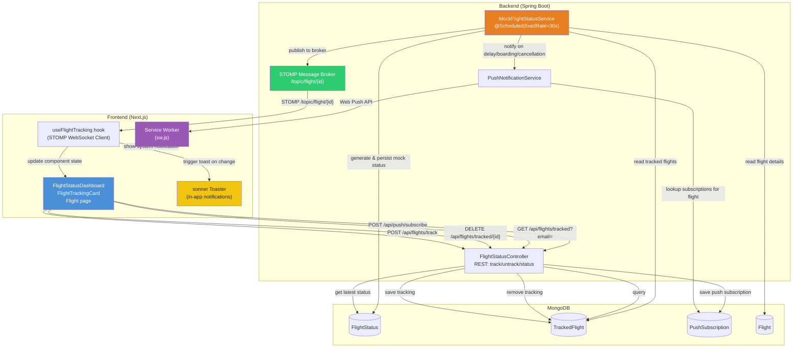

# Live Flight Status — Data Flow Diagram

## Flow Steps

| Step | Component | Action | Destination |
|------|-----------|--------|-------------|
| 1 | User clicks "Track Flight" | `POST /api/flights/track` | → `TrackedFlight` collection |
| 2 | `MockFlightStatusService` (every 30s) | Iterates tracked flights, random status update | → `FlightStatus` doc + STOMP broker |
| 3 | STOMP Broker | Pushes to `/topic/flight/{flightId}` | → Frontend WebSocket hook |
| 4 | `useFlightTracking` hook | Parses message, updates React state | → `FlightTrackingCard` re-render |
| 5 | Hook detects status change | Calls `sonner.toast()` | → In-app notification |
| 6 | `MockFlightStatusService` (critical changes) | Triggers `PushNotificationService` | → Web Push API → Service Worker |
| 7 | Service Worker | Displays system notification | → OS notification tray |
| 8 | User clicks "Untrack" | `DELETE /api/flights/tracked/{id}` | → Removed from `TrackedFlight` |

## Status Values

| Status | Meaning | Color |
|--------|---------|-------|
| `ON_TIME` | Operating as scheduled | Green |
| `DELAYED` | Delayed (reason + revised time shown) | Red |
| `BOARDING` | Boarding in progress | Blue |
| `DEPARTED` | Flight has departed | Purple |
| `LANDED` | Flight has arrived | Green |
| `CANCELLED` | Flight cancelled (reason shown) | Red |

## Delay Reasons (Mock Pool)

- Weather conditions at origin/destination
- Technical maintenance
- Air traffic congestion
- Late arrival of incoming aircraft
- Crew scheduling
- Security checks
- Operational requirements
